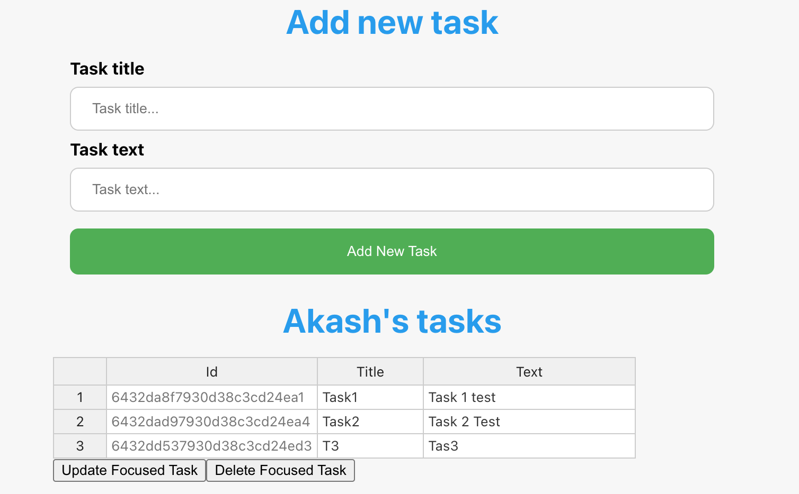

# Simple Task Management

Simple MERN project for task list management


## Tech Stack

**Client:** React, Axios

**Server:** Node, Express

**Database:** MongoDB


## Screenshots



## Run Locally

Clone the project

```bash
  git clone <git link>
```

### MongoDB **Data ** 🖧
**1.** Install DB(Mongo)
```bash 
   brew install mongodb-community
```

**2.** Install backend (Node)

```bash
  cd backend
  npm install
```

**3.** Change **serverUrl** in **index.js** file to your custom url 
```bash
  const serverUrl = '127.0.0.1'
```
**4.** Start the server

```bash
  npm start
```

### Add configurations for **Frontend** 🖥 
**5.** Go to frontend folder

```bash
  cd frontend
  npm install
```
**6.** Change **backendUrl** in **App.js** 

```bash
  const backendUrl = 'YOUR_BACKEND_URL'
```

**7.** Start the server

```bash
  npm start
```